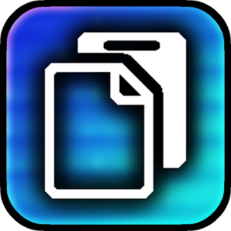
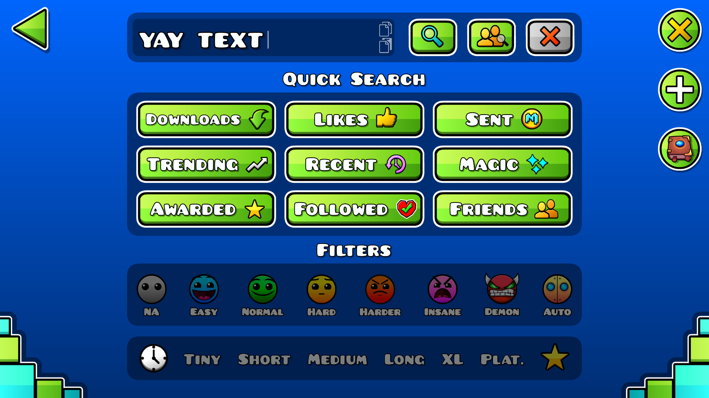
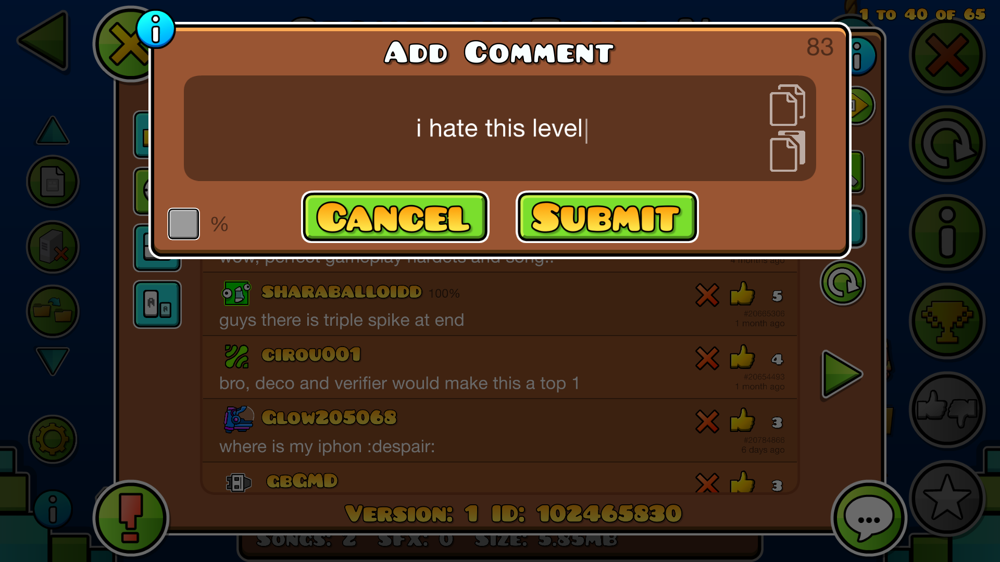

#  Easy Clipboard
Add clipboard buttons to text input fields.

---

>   

>  
>  
> 

> [!TIP]
*This mod has settings you can utilize to customize your experience.*

---

## About
This mod adds a copy and a paste button on every text input field you can find in the game when you focus on them!

---

### Customization
In this mod's settings, you can find the options you need to re-scale the buttons to your liking as well as adjust their opacity, among others. Feel free to tweak these as you need!

> [!NOTE]
> *Clipboard buttons are **disabled** by default in the level editor **on desktop**. You can change this through the mod's settings.*

### Notice
This mod depends on [FixThoseDangInputNodes!](https://www.geode-sdk.org/mods/cheeseworks.fixinputnodesizes), a **lightweight mod that provides crucial fixes to vanilla UI** to ensure proper clipboard UI positioning across the entire game.

---

---

### Changelog
###### What's new?!
**[📜 View the latest updates and patches](./changelog.md)**

### Issues
###### What's wrong?!
**[⚠️ Report a problem with the mod](../../issues/)**